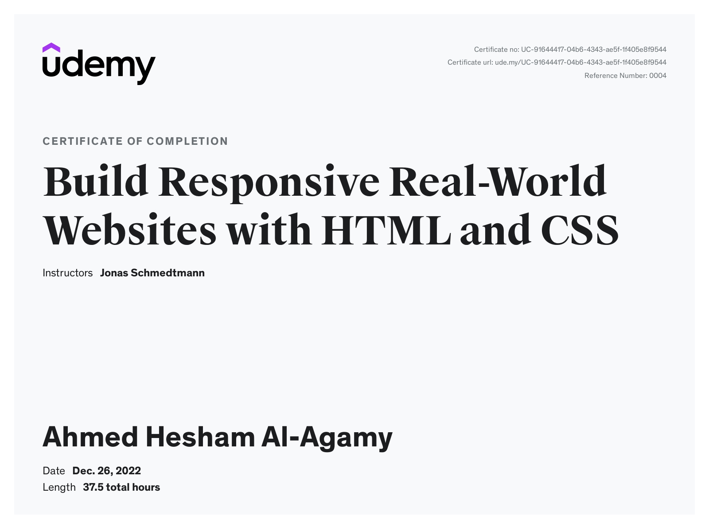

# Build Responsive Real-World Websites with HTML and CSS Course - Content preview

<h1>
  This is Build Responsive Real-World Websites with HTML and CSS :heart:
</h1>

Hi, My name is Ahmed Hesham and this is my apply what I learned in this course with the instructor

## Welcome! 👋

Thanks for checking out this JavaScript content.

**To complete this challenge, I studied for a long time and it was a very interesting trip and I learned a lot from Jonathan and I wish for him a great success and special thanks to those in charge of the Al-Bunyan Al-Marsous competition, especially Engineer Ahmed Fathi, for their efforts, and I wish for them a great success.**

### Course Link

